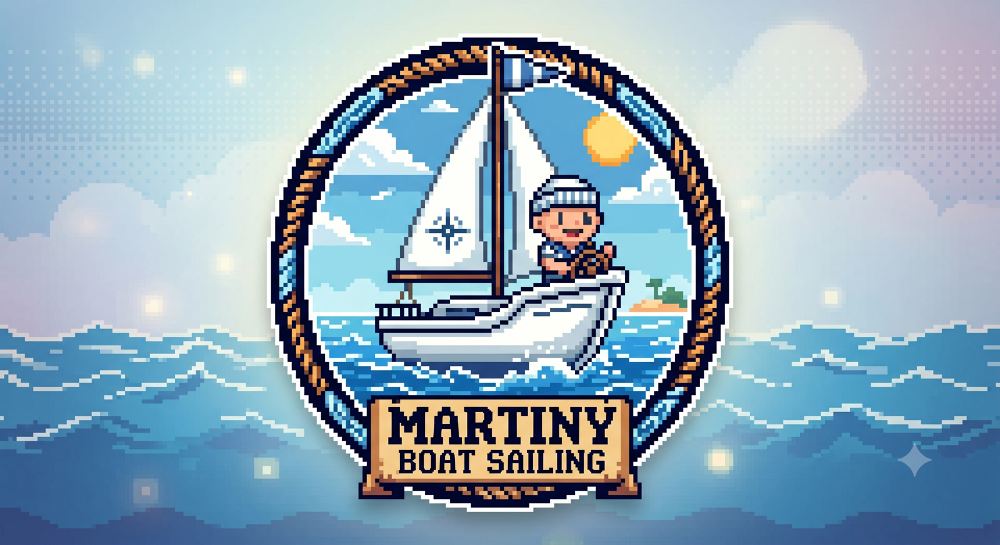

# Martiny Boat Sailing

A top-down 2D sailing simulator built to learn real sailing fundamentals through play. Control the rudder and mainsail trim to navigate wind, round buoys, and dock — all with physics that punish a sloppy sail just like the real thing.

## How to play

Open `index.html` in a browser. No build step, no server required.

Works on desktop (mouse) and mobile (touch). Two independent drag controllers handle the tiller and mainsheet simultaneously.

## Maps

| # | Name | Goal |
|---|---|---|
| 1 | Single Buoy | Round one buoy and return to start |
| 2 | Two Buoys | Round two buoys in order |
| 3 | Olympic Triangle | Classic racing triangle |
| 4 | Island Marina | Dock at the marina without crashing |

## Controls

- **Tiller (Caña)** — drag horizontally to steer. Real-world inversion: drag right → turn left.
- **Mainsheet** — drag the cleat handle up to trim in, down to ease out. The rope shape tells you the sail state.

## Features

- Realistic points of sail: close-hauled, beam reach, broad reach, running, and the dreaded irons
- Wind speed and direction configurable per session
- Vector overlays: wind, heading, velocity, inertia bar (toggleable)
- Mini-map with buoy tracking
- Elapsed timer — compare times with friends for the same wind config
- Haptic feedback on mobile
- ES / EN

## Stack

Pure static HTML + vanilla JS. [Phaser 3](https://phaser.io) for rendering. No framework, no bundler, no backend.
